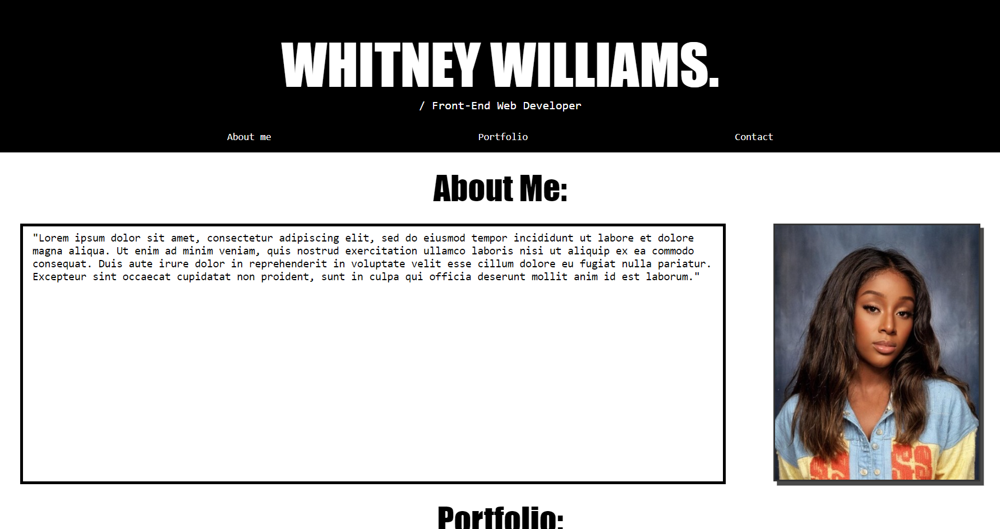
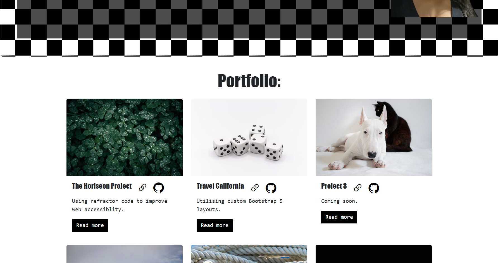

# Whitney Williams' Bootstrap Portfolio

## Description

Welcome to my updated portfolio page.

Following on from last week's challenge, I have re-created my portfolio page using Bootstrap 5 elements.

## About The Project

### This is how the original project looked before the changes:

#### [You can visit this page by clicking here.](https://whit-williams.github.io/ww-portfolio/)

### This is a snapshot of the updated page:

#### [You can visit this page by clicking here.](https://whit-williams.github.io/Bootstrap-Portfolio/)

### Project Status
This is a living project that will be regularly updated as I progress on the web development journey!

- Some project links are currently deadlinks pending the creation of additional projects

### Technologies
This project is created with:

- Visual Studio Code 1.83.1
- Git Bash 5.2.15
- Bootstrap 5

### Key Features
- A navigation bar with a menu that links to each section of web page
- A jumbotron featuring my picture, name and brief description, linking to a more detailed about me section
- A portfolio section that uses Bootstrap cards, with links to both the live project and GitHub code repository
- A Skills section styled with progress bars 
- Combined About me and Contact section
- Hover effects on both hyperlinks and buttons

### Credits
- Free placeholder images https://pixabay.com/
- How to add social media buttons https://www.w3schools.com/howto/howto_css_social_media_buttons.asp
- How to add progress bars https://verpex.com/blog/website-tips/how-to-style-a-progress-bar-using-css
- Page icons https://fontawesome.com/icons/envelope?f=classic&s=solid

### License 
None

